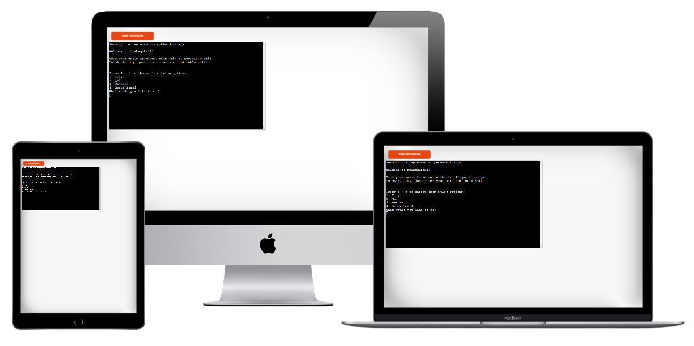

Ever wonder about how well do you know about snakes? 
# Welcome to **[Snakequiz](https://snakequiz-pp3.herokuapp.com/)**, and test your knowledge!

## **Purpose of the game**

This game is aimed to test as well as entertain children and adults who are interested in snakes and want to know more about it. After each question, there is also an interesting fact related to the question that will be displayed, to give the player a bit more in depth information. Main objectives are:

- to test the player's knowledge about snakes
- to challenge the players memory 
- to increase the players's interests and curiousity about snakes 
- and most importantly to LOVE NATURE

------

## **Why This**

This snake quiz was inspired by my 8 year old who has a fascination about snakes, and strange insects. Personally, I was never a big fan of snakes, mainly scared of them. However, in my son’s eyes, they are cute and beautiful. I guess when you look at those pictures, you could say that:

 
 

Being an encouraging mom I did try to gather all the information out there to satisfy his curious mind. In the process, I ended up learning a fair amount of interesting facts about the creature. He did ask for a snake as a pet, I couldn't agree with that, but I decided to build this quiz instead. Hoping other people could learn a thing or two about snakes by playing this quiz, to spark interest and dive deep into it, not only about snakes but about nature in general.

------

## **Features:**
### Existing Features:
#### Home page:
Here is the **[live site:](https://snakequiz-pp3.herokuapp.com/)**

First thing you will notice is the welcome message with the title of “SNAKEQUIZ” ASCII in star wars style, because it is cool. With some simple instructions of the game below.

 

Followed by the Menu with 4 options, allowing the player to choose between start the quiz, quit, restart and Scoreboard. 

Menu item 1 Play: when the player chooses the Play option, the system will ask for an input of the chosen player name. With specified information about what you can use in the player name and the max number of characters. If any character is not a letter or digit, or the length is more than 8 characters, the system will detect it, and trigger an error message to be displayed. The system will keep requesting the player name until a valid answer is received, then the quiz will start.

Below are the Error Message Examples:

Menu item 2 Quit: when the player chooses the Quit option, the system will display a goodbye message, and end. You need to click on the “Run Program” button on the top of the screen to reactivate the program.

Menu item 3 Restart : you would choose this option when you have already played your 1st game, and would like to play again. By choosing this option, the quiz will start straight away without asking you to input username. That is assuming you will not choose this option if you are playing for the first time.

Menu item 4 Scoreboard: by choosing this option, the system will display the top 10 player scores of all time in the descending order, with their name and time stamp. Followed by the game menu, so the player can choose their next move.

