Ever wonder about how well do you know about snakes? 
# Welcome to **[Snakequiz](https://snakequiz-pp3.herokuapp.com/)**, and test your knowledge!

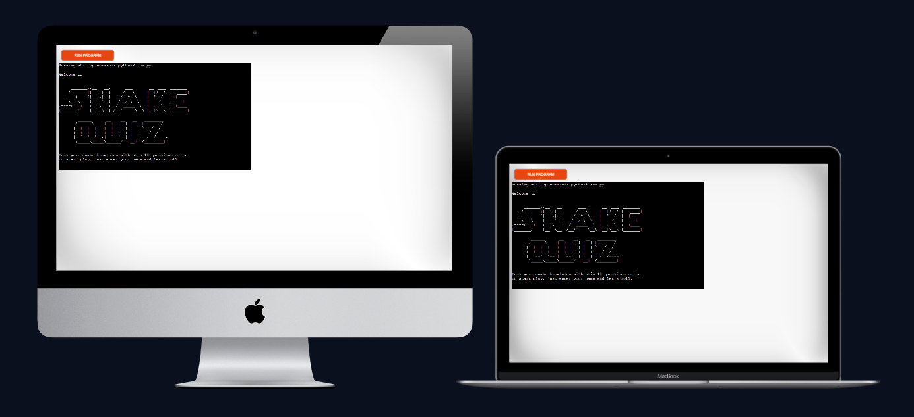

- [**Purpose of the game**](#--purpose-of-the-game--)
- [**Why This**](#--why-this--)
- [**Features:**](#--features---)
  * [Existing Features:](#existing-features-)
    + [**Home page**:](#--home-page---)
    + [Menu Item 1 **Play**](#menu-item-1---play--)
    + [Menu Item 2 **Quit**](#menu-item-2---quit--)
    + [Menu Item 3 **Restart**](#menu-item-3---restart--)
    + [Menu Item 4 **Scoreboard**](#menu-item-4---scoreboard--)

<small><i><a href='http://ecotrust-canada.github.io/markdown-toc/'>Table of contents generated with markdown-toc</a></i></small>

## **Purpose of the game**

This game is aimed to test as well as to entertain children and adults who are interested in snakes and want to know more about it. After each question, there is also an interesting fact related to the question that will be displayed, to give the player a bit more in depth information. Main objectives are:

- to test the player's knowledge about snakes
- to challenge the players memory 
- to increase the players's interests and curiousity about snakes 
- and most importantly to LOVE NATURE

------

## **Why This**

This snake quiz was inspired by my 8 year old who has a fascination about snakes, and strange insects. Personally, I was never a big fan of snakes, mainly scared of them. However, in my son’s eyes, they are cute and beautiful. I guess when you look at those pictures, you could say that:

 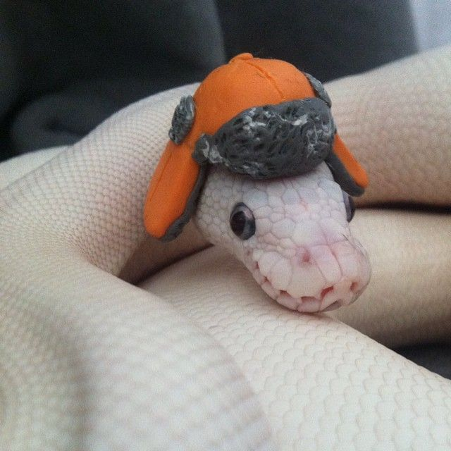
 
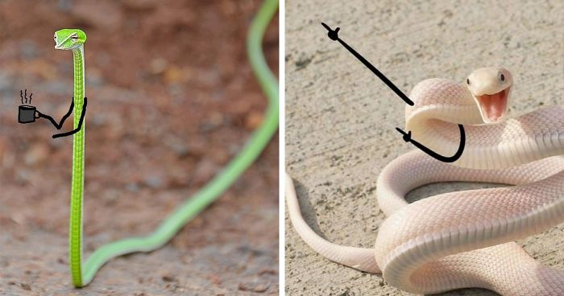

Being an encouraging mom I did try to gather all the information out there to satisfy his curious mind. In the process, I ended up learning a fair amount of interesting facts about the creature. He did ask for a snake as a pet, I couldn't agree with that, but I decided to build this quiz instead. Hoping other people could learn a thing or two about snakes by playing this quiz, to spark interest and dive deep into it, not only about snakes but about nature in general.

------

## **Features**
### Existing Features:
#### **Home page**:
Here is the **[live site:](https://snakequiz-pp3.herokuapp.com/)**

First thing you will notice is the welcome message with the title of “SNAKEQUIZ” ASCII in star wars style, because it is cool. With some simple instructions of the game below.

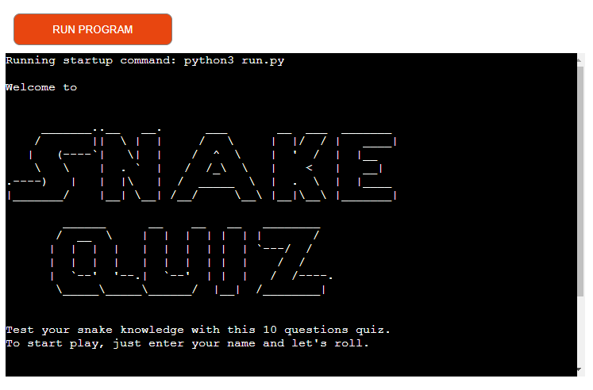

 

Followed by the Menu with 4 options, allowing the player to choose between start the quiz, quit, restart and Scoreboard. 

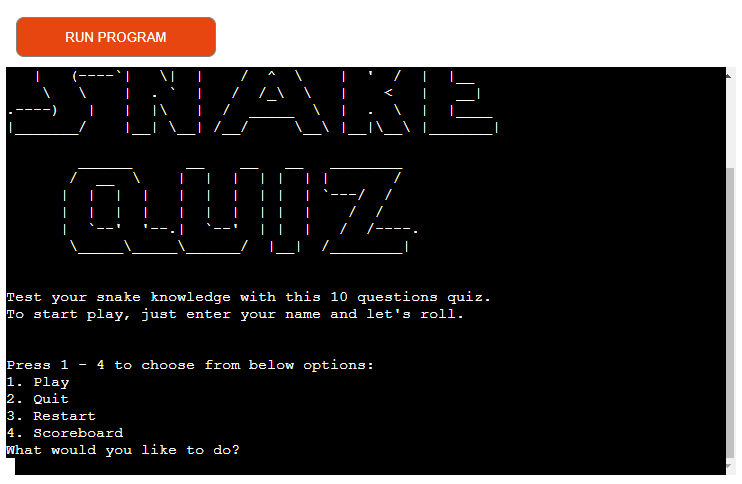

#### Menu Item 1 **Play**

When the player chooses the Play option, the system will ask for an input of the chosen player name. With specified information about what you can use in the player name and the max number of characters. If any character is not a letter or digit, or the length is more than 8 characters, the system will detect it, and trigger an error message to be displayed. The system will keep requesting the player name until a valid answer is received, then the quiz will start.

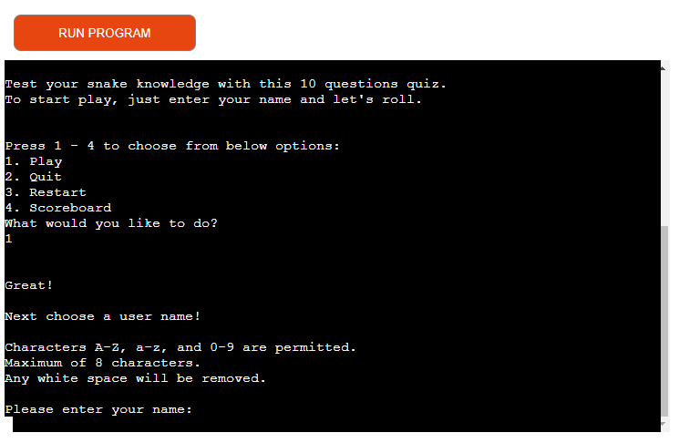

Below are the Error Message Examples:

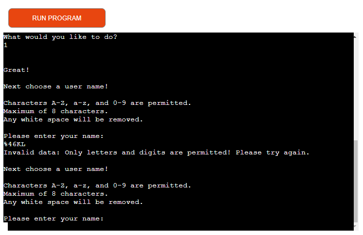
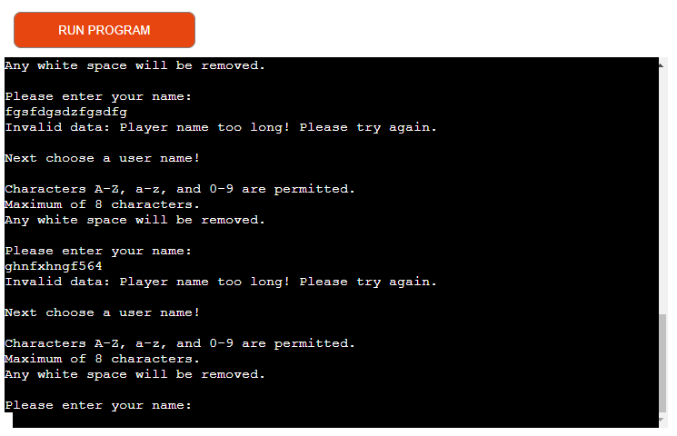

There are 10 questions in total as indicated at the beginning of the quiz. Mixed with Y/N and multiple choice questions, here will display an instruction about how to answer each type of question.

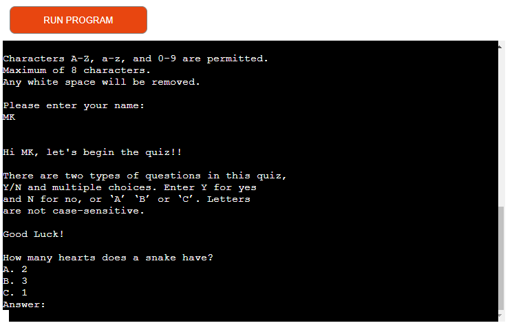

Each question will provide the player with feedback whether their answer was correct or not. Followed by an interesting fact related to that particular question, to give the player a bit more information for “good to know” purposes.

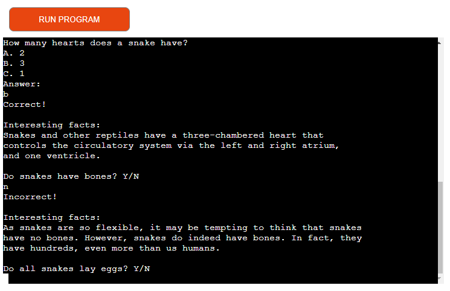

After completing all 10 questions, a final score will be displayed to the player, as well as the game menu, giving players the opportunity to choose their next move.

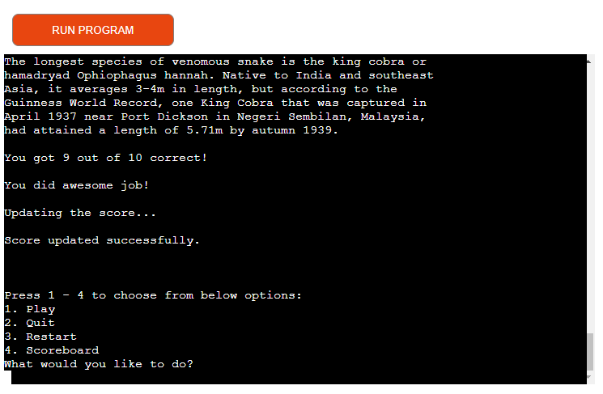

Meanwhile, the final score along with the player's name and time stamp will be registered on the google sheet which is linked to the quiz game via API.

#### Menu Item 2 **Quit**

When the player chooses the Quit option, the system will display a goodbye message, and end. You need to click on the “Run Program” button on the top of the screen to reactivate the program.

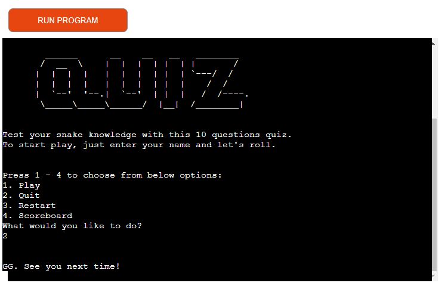

#### Menu Item 3 **Restart**

You would choose this option when you have already played your 1st game, and would like to play again. By choosing this option, the quiz will start straight away without asking you to input username. That is assuming you will not choose this option if you are playing for the first time.

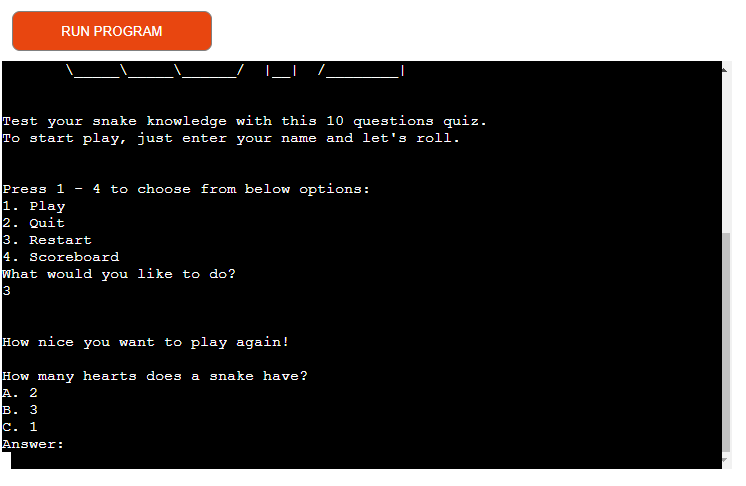

#### Menu Item 4 **Scoreboard**

By choosing this option, the system will request the information from the google sheet via API, and display the top 10 player scores of all time in the descending order, with their name and time stamp on the side. Followed by the game menu, so the player can choose their next move.

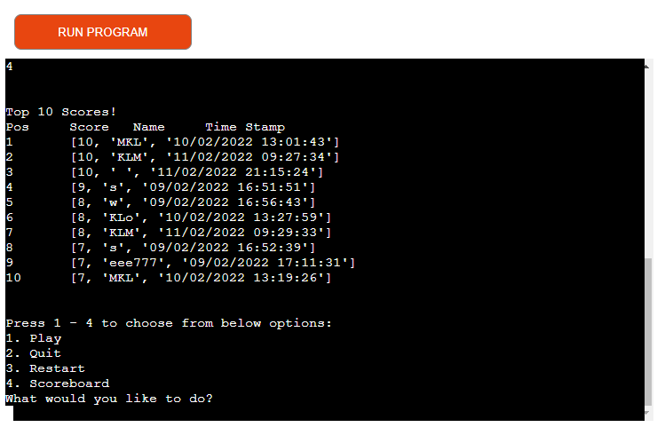

 

### New Features in the future update:
#### Menu Item: **My Last 4 Scores**

My mentor gave me this idea, so originally I planned for 5 options in the game menu, with the last one to display a single player’s last 4 scores. I thought this feature is nice, because it will allow the players to keep track of their own scores. Unfortunately, I didn’t manage to make it work, and it seems to add a lot of complexity to the game, which with my current skill set is a bit out of reach. Hopefully in the future, as I progress further in the coding journey, I will be able to make it work.

#### Quiz: **Allow player to add more questions**

It would be nice to have a feature that allows players to add more questions in the quiz section, to test / share the knowledge with others, to expand the scope.

#### Game: **Chatbox**

Inspired by CI’s slack channel, why not have a place that will allow players to chat with each other, learn from each other and inspire one another. Afterall, they share a common interest in snakes.

## **Game Logic**
### Flowchart

 

## **Data Model**
[Google sheet](https://docs.google.com/spreadsheets/u/0/) was used to store information like score, player’s name and the time stamp. When the player chooses to see the Top 10 scores, the system will read the whole data from this sheet and display only the highest 10.

 

## **Technology Used**
### **Language**

This is a command-line application built purely using python as the main programming language

### **Tools**
- [Github](https://github.com/) for store and version control of the code

- [Gitpod](https://gitpod.io/workspaces) for editing code

- [Heroku](https://heroku.com/) for deployment

- [draw.io](https://app.diagrams.net/) for creating flowchart

- [Patorjk.com](https://patorjk.com/software/taag/#p=display&f=Star%20Wars&t=Type%20Something%20) for creating the cool looking game title at the beginning of the game

- [Lightshot](https://app.prntscr.com/en/index.html) for creating screenshots

- [GitHub Wiki TOC generator](https://ecotrust-canada.github.io/markdown-toc/) for generating table of content for README.md file

- [techsini.com](https://techsini.com/multi-mockup/index.php) for generating the mock up

- [Google Image](https://www.google.com/search?q=cute+snake&sxsrf=APq-WBtiN9NnHc8YW9Ugr5ZmfkmyOwTAjw:1644681215048&source=lnms&tbm=isch&sa=X&ved=2ahUKEwjdp938wvr1AhUtlYsKHWDdDn8Q_AUoAXoECAIQAw&biw=1920&bih=937&dpr=1) for downloading the cute snakes pictures

 

## **Testing**
### **Code Validation on PEP8**
Run.py

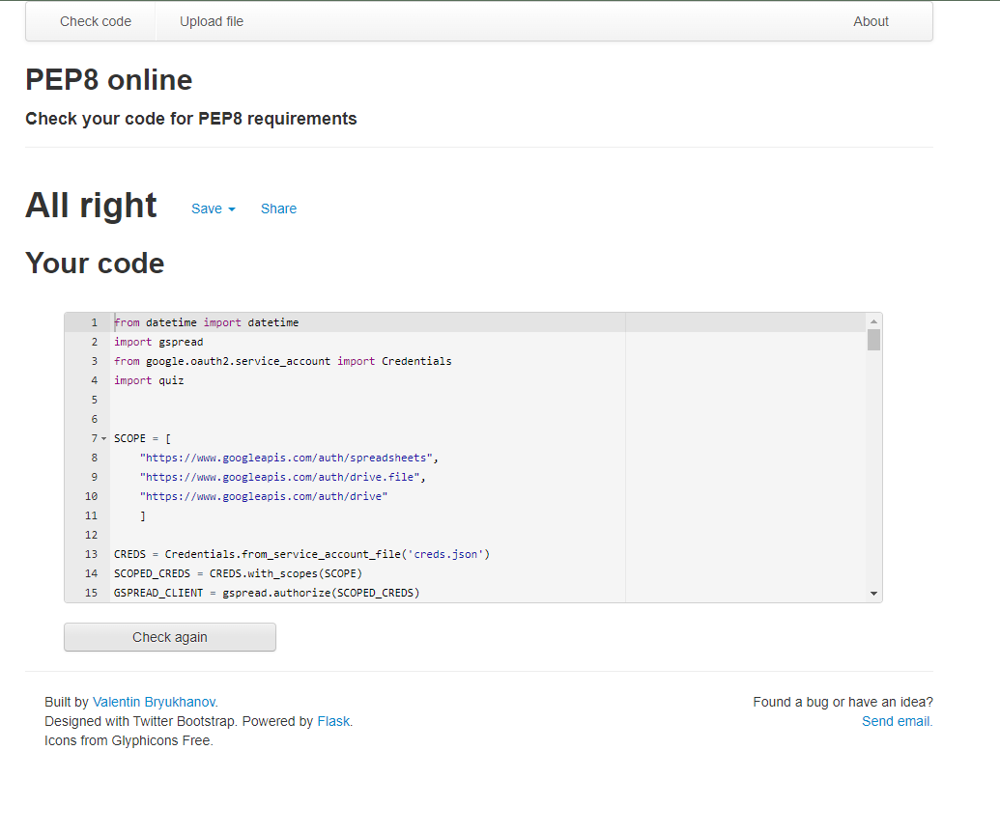

Quiz.py

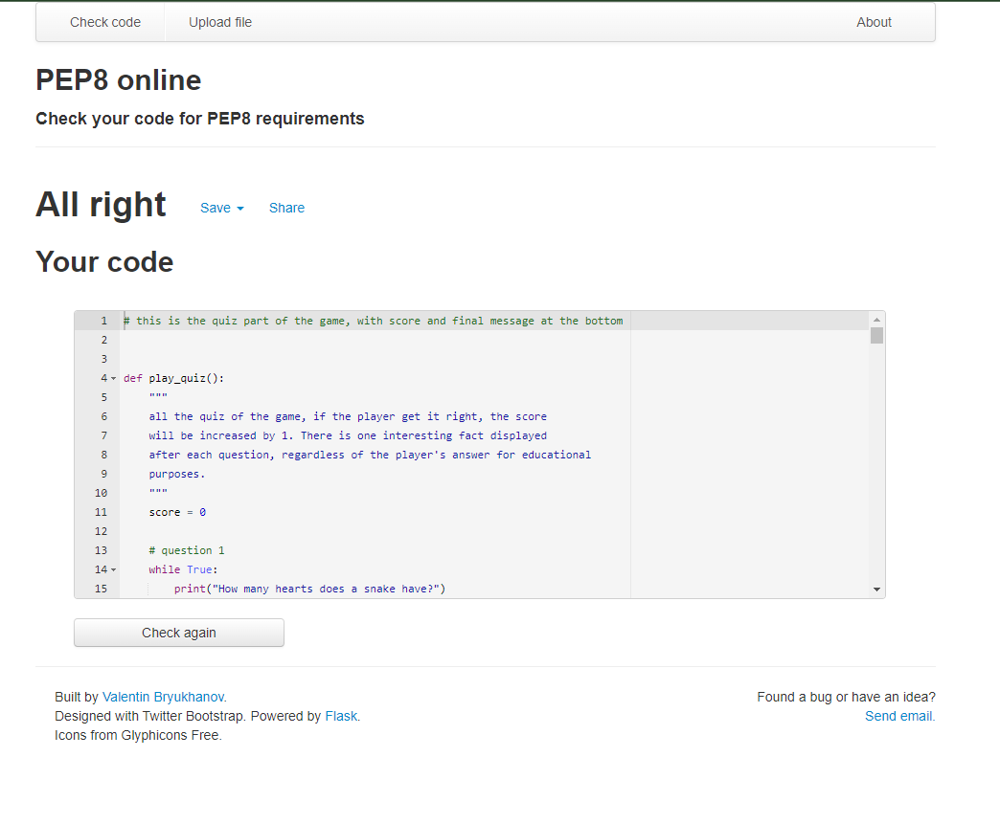

### **Bugs**
#### *Fixed Bugs*
1 
When score is greater than 7, the print statement of "You did awesome job!" doesn’t work

 
Solution: With my mentor’s help, turned out the word “and” was missing

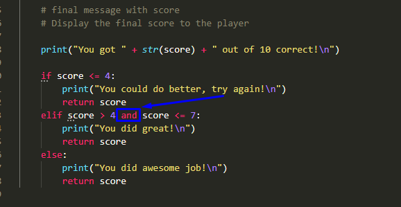

2 
Once the quiz starts, it will go to the next question, even the error message displayed.

Solution: Turned out I forgot the while loop, added them to each question, and the problem was fixed.

3 
The display_top_10 function was only displaying the records from 9 and below, even if there was a score of 10 in the google sheet.

Solution: I Joined a call in study_group channel on slack, and with the help of DaveHorrocks_5P, Daisy_mentor, Charlie, and Sensei Bim, it got solved. What I learned in the process was how they debug and look at the problem from different angles. Not to mention how much I admire the intelligence and the positive energy between them. They are always ready to offer help.

#### *Unfixed Bugs*
1 
For menu item 3: **restart**, players can still access it from the beginning of the game. So they can skip the step of creating the player name and start the quiz right away. The system will have their score written in the google sheet, but without any player name as a result.

2 
The player name is not unique at the moment

## Deployment

## Credits

- Code Institute's [Love Sandwiches project](https://github.com/Code-Institute-Solutions/love-sandwiches-p5-sourcecode/tree/master/05-deployment/01-deployment-part-1)

- Tutor support from Code Institute for helping me out when I got stuck. Special shout out to Ger, who helped me to solve multiple problems that was driving me nuts. 

- The display_top_10_scores function didn’t work properly, and I tried different things. In the end Mr Suffar’s [video](https://www.youtube.com/watch?v=HRJRq2r7eL8) gave me an idea and I took part of his code, and made it work in mine.

- [Stackoverflow](https://stackoverflow.com/) for researching a list of things, [this article](https://www.programiz.com/python-programming/methods/string/isalnum) to learn about isalnum() for checking any characters that are not letter or digit, that I used in the check_player_name function as one of the validator.

## **Acknowledgments **
My mentor Mr. ADEGBENGA ADEYE for his continuous and structured feedback and support. My project won't be the same without his valuable advice.

Tutor support at Code Institute. They are always there when I need help, I am really grateful for that.

Fellow students on Slack community for their help and support, it feels nice to learn and grow with them together.

Most importantly, I would like to thank my husband who supported me every step in my coding journey, and my son who inspired me to build this project. 

THANK YOU ALL!!!

